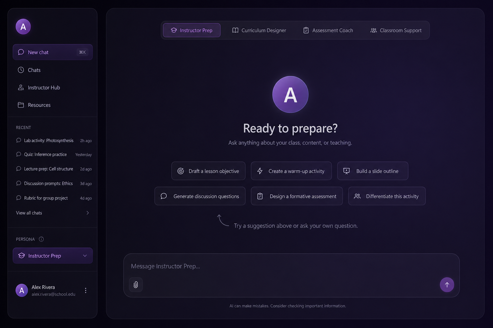
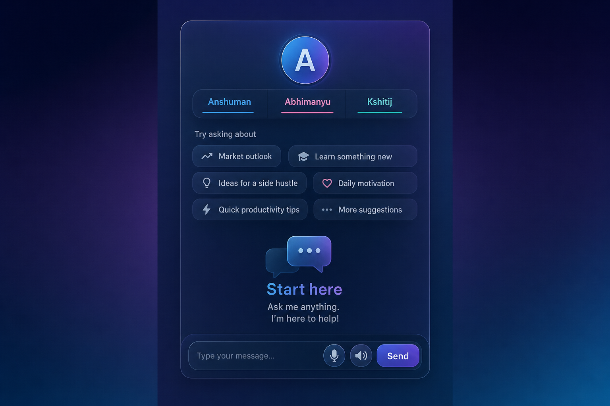

# Denominator

A small Next.js chat app where you pick one of three instructor-style personas (Scaler / InterviewBit inspired). Each persona uses a distinct system prompt and the same Gemini model with streaming replies.

## Live demo

**https://denominator-411746695116.asia-south1.run.app**

(GCP project `revsight-492123`, region `asia-south1`. Redeploy after local changes with `npm run deploy:gcloud`.)

## Screenshots

Representative UI captures in the same Orchy-inspired dark wash, cream/ink/lavender palette, and glass chat shell as the app. The running UI is the source of truth.

### Desktop width

### Mobile width

## Setup

1. Clone the repo.
2. `npm install`
3. Copy `.env.example` to `.env.local` and set `GEMINI_API_KEY`.
4. `npm run dev` and open http://localhost:3000

## Tech stack

- Next.js (App Router)
- React 19
- Google Gemini (`@google/generative-ai`, model `gemini-3-flash-preview`) with SSE streaming
- OrchyPage-inspired UI: Cormorant Garamond + Nunito, oklch tokens (cream / ink / lavender / rose), wash layers, staggered `orch-rise` reveals, petal-style idle on the talking head
- CSS design tokens only (no UI framework)
- Talking head with idle / thinking / speaking motion tied to chat and optional TTS
- Web Speech dictation (mic) when the browser supports it, plus optional `speechSynthesis` for replies

## Persona images

Default avatars are generated initials on a gradient (`public/personas/*.png`). To regenerate them:

`powershell -ExecutionPolicy Bypass -File scripts/render-persona-pngs.ps1`

Swap in real headshots later by replacing those files (same names).

## Docs for grading

- See `prompts.md` for the three system prompts and why they are shaped the way they are.
- See `reflection.md` for a short writeup on what worked and what you would improve.

## Docker / Cloud Run

The repo includes a multi-stage `Dockerfile` and `output: "standalone"` in `next.config.mjs`.

Redeploy from the repo root (writes gitignored `.gcloud-env.yaml` from `.env.local`, uses `--quiet` so gcloud does not block on prompts):

`npm run deploy:gcloud`

Manual equivalent:

`node scripts/write-gcloud-env.mjs`

`gcloud run deploy denominator --source . --region asia-south1 --allow-unauthenticated --env-vars-file .gcloud-env.yaml --quiet`
